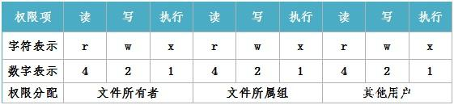

# CentOS7目录和文件的属性和权限


## 概述
在CentOS文件系统的安全模型中，为系统中的文件（或目录）赋予了两个属性：访问权限和文件所有者，简称为“权限”和“归属”。其中，访问权限包括读取、写入、可执行三种基本类型，归属包括属主（拥有该文件的用户账号）、属组（拥有该文件的组账号）。CentOS系统根据文件或目录的访问权限、归属来对用户访问数据的过程进行控制。


## 查看目录和文件的属性


使用带“-l”选项的ls命令时，将以长格式显示文件或目录的详细信息，其中包括了该文件的权限和归属等参数。例如，执行以下操作可以列出/root/anaconda-ks.cfg文件的详细属性。
```
#ls -l /root/anaconda-ks.cfg 
-rw-------. 1 root root 953 Dec 22  2014 /root/anaconda-ks.cfg
```

### “-rw-------. ”由四部分组成，各自的含义如下：

- 第1个字符：表示该文件的类型，可以是d（目录）、b（块设备）、c（字符设备文件）、“-”（普通文件）、字母“l”（链接文件）等。

- 第2~4个字符：表示该文件的属主用户（user）对该文件的访问权限。

- 第5~7个字符：表示该文件的属组内各成员用户对该文件的访问权限。

- 第8~10个字符：表示其他任何用户（Other）对该文件的访问权限。

- 第11个字符：这里的“.”与SELinux有关。

“r、w、x”分别表示可读、可写、可执行。若需要去除对应的权限，则使用“-”表示。


## 设置目录和文件的权限

通过chmod命令设置文件或目录的权限，可以采用两种形式的权限表示方法：字符形式和数字形式。r、w、x权限字符可分别表示为八进制数字4、2、1，表示一个权限组合时需要将数字进行累加。


如：“rwx”采用累加数字形式可表示为“7”，“r-x”可表示为“5”，而“rwxr-xr-x”由三个权限段组成，因此可以表示成“755”

- chmod命令格式

```
chmod nnn 目录或文件
```

- 示例
```
 chmod 755 /usr/share/zabbix/assets
```
  

## 设置目录和文件的归属  

使用chown命令为文件或目录设置归属。

- chown命令格式  

```
chown 属主 文件或目录

chown :属组 文件或目录

chown 属主:属组 文件或目录
```
  

注：同时设置属主、属组时，用户名和组名之间用冒号“：”进行分隔。如果只设置属组时，需使用“：组名”的形式。

- 常用选项

-R：递归修改指定目录下所有文件、子目录的归属 

- 示例  
```
 chown apache /usr/share/zabbix/assets
```