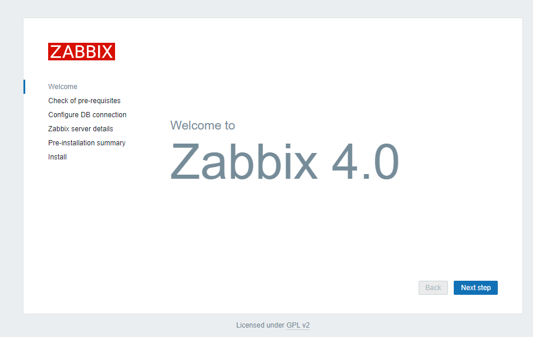
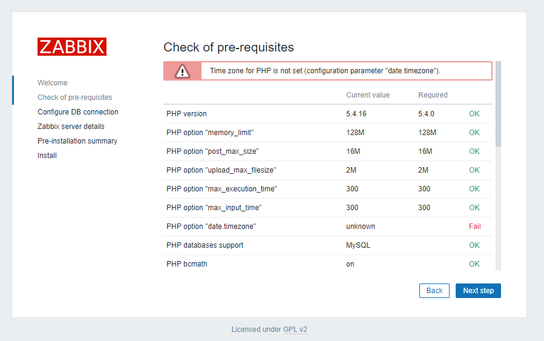
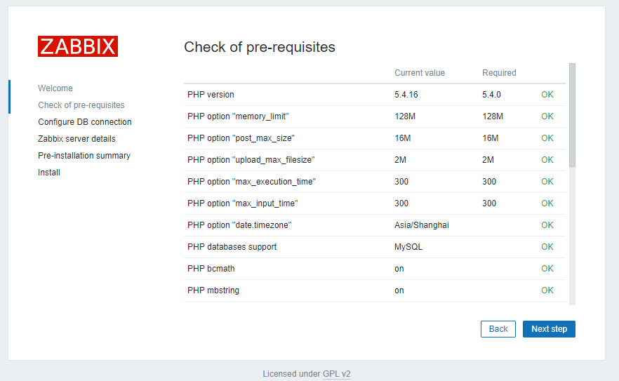
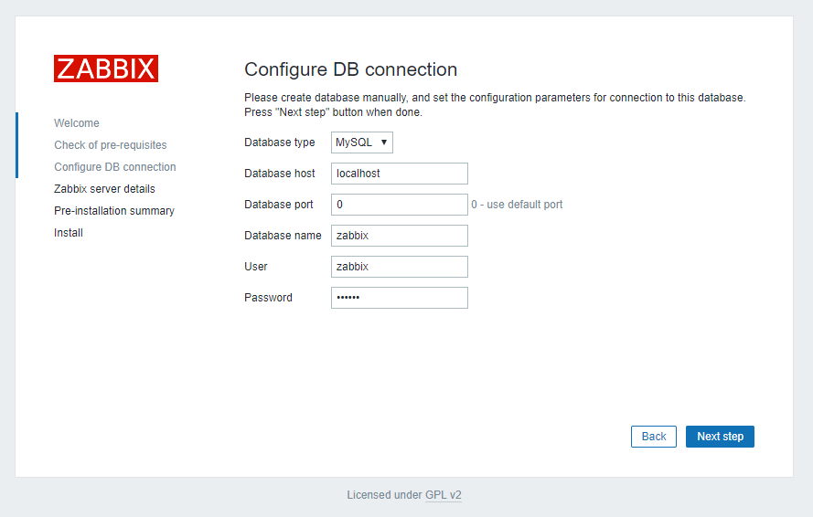
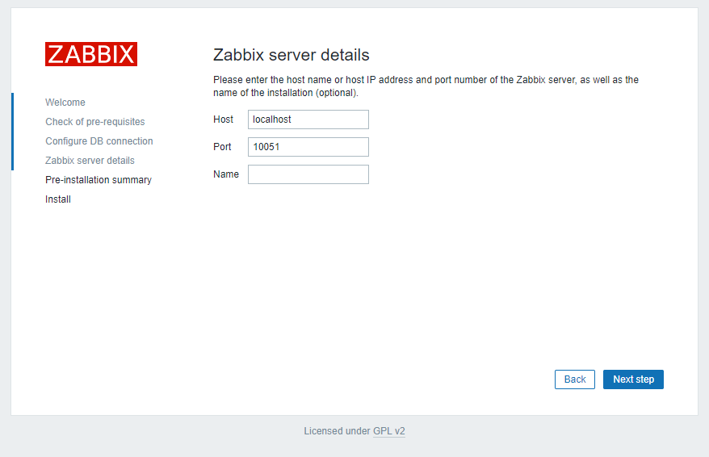
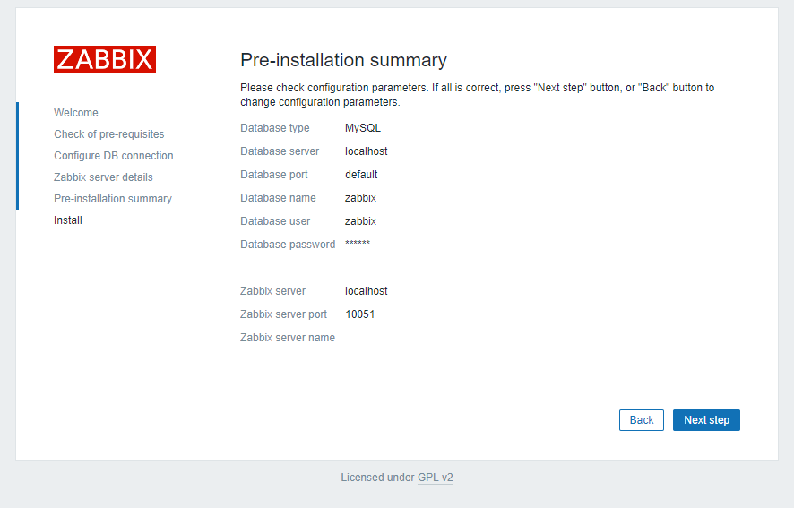
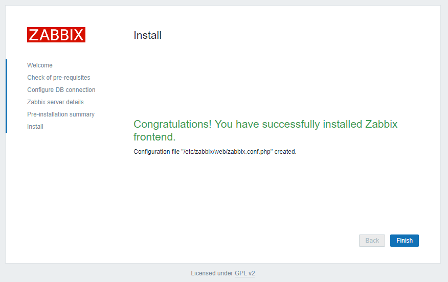
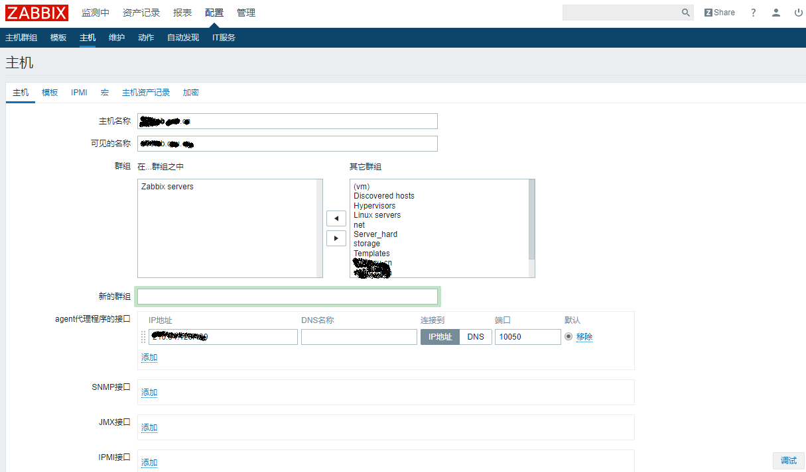
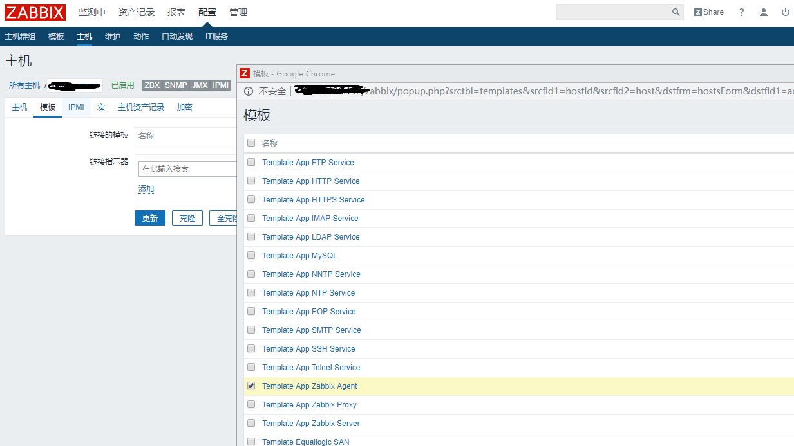
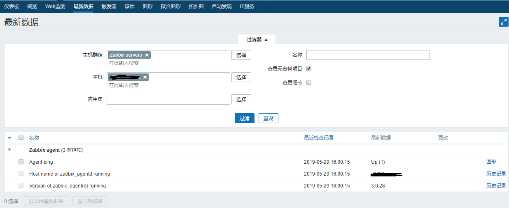

# CentOS7 zabbix  安装

搭建完整zabbix监控系统。配置Zabbix监控服务器端，需要能够上网的公网环境。


## yum安装MariaDB
MariaDB的目的是完全兼容MySQL，包括API和命令行，使之能轻松成为MySQL的代替品。
```
yum -y install mariadb-server mariadb
#启动和开机自启数据库
systemctl start mariadb && systemctl enable mariadb
```


## rpm安装zabbix的yum源
```
rpm -ivh https://repo.zabbix.com/zabbix/4.0/rhel/7/x86_64/zabbix-release-4.0-1.el7.noarch.rpm

```

## 开始安装zabbix
- 安装zabbix
```
yum install zabbix-server-mysql zabbix-web-mysql zabbix-agent
```
- 更新时区  
系统初始化时候要求时区。
```
#编辑/etc/httpd/conf.d/zabbix
#vi /etc/httpd/conf.d/zabbix.conf
php_value date.timezone Asia/Shanghai
#重启httpd
systemctl restart httpd
```

## 创建zabbix数据库
### 创建zabbix初始数据库
```
mysql -uroot
MariaDB [(none)]> create database zabbix character set utf8 collate utf8_bin;
MariaDB [(none)]> grant all privileges on zabbix.* to zabbix@localhost identified by 'zabbix';
MariaDB [(none)]> quit
```
### 导入初始模式和数据
```
zcat /usr/share/doc/zabbix-server-mysql*/create.sql.gz | mysql -uzabbix -p zabbix
```

## 为Zabbix服务器配置数据库
```
# vi /etc/zabbix/zabbix_server.conf
DBHost=localhost
DBName=zabbix
DBUser=zabbix
DBPassword=zabbix
```

## 启动Zabbix服务器和代理进程，并在系统启动时启动

```
systemctl start zabbix-server zabbix-agent httpd && systemctl enable zabbix-server zabbix-agent httpd

```
- 开启防火墙端口
firewall-cmd --permanent --add-port=80/tcp
firewall-cmd --reload


浏览器打开http://10.41.10.110/zabbix
安装初始化。








用户Admin,zabbix


## 安装配置zabbix-agent
防火墙设置，允许zabbix-agent的10050端口通过
```
firewall-cmd --permanent --add-port=10050/tcp
firewall-cmd --reload
```
非本机的zabbix客户端，让服务器端能访问到客户的信息。修改三行信息，本地为127.0.0.1，其他设备为10.4.10.10。
```
# rpm安装zabbix的yum源
rpm -ivh https://repo.zabbix.com/zabbix/4.0/rhel/7/x86_64/zabbix-release-4.0-1.el7.noarch.rpm
#安装zabbix-agent
yum install zabbix-agent
#配置zabbix-agent
#vi /etc/zabbix/zabbix_agentd.conf
Server=127.0.0.1  #10.4.10.10  #Server端的IP地址
ServerActive=127.0.0.1  #10.4.10.10,zabbix server 默认端口10051
Hostname=127.0.0.1  #本机的名字
```






## 注意事项

- 配置selinux
```
setsebool -P httpd_can_connect_zabbix=1
```
- 关闭selinux
```
setenforce 0  #临时
#sed -i 's/SELINUX=enforcing/SELINUX=disabled/' /etc/selinux/config  ##永久关闭
#setsebool -P httpd_can_connect_zabbix=1
```

## 参考
- [Download and install Zabbix](https://www.zabbix.com/download?zabbix=4.0&os_distribution=centos&os_version=7&db=mysql)
- [Red Hat Enterprise Linux/CentOS](https://www.zabbix.com/documentation/4.0/manual/installation/install_from_packages/rhel_centos)

## 安装过程的日志

### 安装zabbix的yum源的日志

```
[root@v06lab home]# rpm -ivh https://repo.zabbix.com/zabbix/4.0/rhel/7/x86_64/zabbix-release-4.0-1.el7.noarch.rpm
Retrieving https://repo.zabbix.com/zabbix/4.0/rhel/7/x86_64/zabbix-release-4.0-1.el7.noarch.rpm
warning: /var/tmp/rpm-tmp.boVuYR: Header V4 RSA/SHA512 Signature, key ID a14fe591: NOKEY
Preparing...                          ################################# [100%]
Updating / installing...
   1:zabbix-release-4.0-1.el7         ################################# [100%]
```


### 数据库安装日志

```
# yum -y install mariadb-server mariadb
Loaded plugins: fastestmirror
Loading mirror speeds from cached hostfile
 * epel: ftp.yz.yamagata-u.ac.jp
Resolving Dependencies
--> Running transaction check
---> Package mariadb.x86_64 1:5.5.60-1.el7_5 will be installed
---> Package mariadb-server.x86_64 1:5.5.60-1.el7_5 will be installed
--> Processing Dependency: perl-DBI for package: 1:mariadb-server-5.5.60-1.el7_5.x86_64
--> Processing Dependency: perl-DBD-MySQL for package: 1:mariadb-server-5.5.60-1.el7_5.x86_64
--> Processing Dependency: perl(DBI) for package: 1:mariadb-server-5.5.60-1.el7_5.x86_64
--> Running transaction check
---> Package perl-DBD-MySQL.x86_64 0:4.023-6.el7 will be installed
---> Package perl-DBI.x86_64 0:1.627-4.el7 will be installed
--> Processing Dependency: perl(RPC::PlServer) >= 0.2001 for package: perl-DBI-1.627-4.el7.x86_64
--> Processing Dependency: perl(RPC::PlClient) >= 0.2000 for package: perl-DBI-1.627-4.el7.x86_64
--> Running transaction check
---> Package perl-PlRPC.noarch 0:0.2020-14.el7 will be installed
--> Processing Dependency: perl(Net::Daemon) >= 0.13 for package: perl-PlRPC-0.2020-14.el7.noarch
--> Processing Dependency: perl(Net::Daemon::Test) for package: perl-PlRPC-0.2020-14.el7.noarch
--> Processing Dependency: perl(Net::Daemon::Log) for package: perl-PlRPC-0.2020-14.el7.noarch
--> Processing Dependency: perl(Compress::Zlib) for package: perl-PlRPC-0.2020-14.el7.noarch
--> Running transaction check
---> Package perl-IO-Compress.noarch 0:2.061-2.el7 will be installed
--> Processing Dependency: perl(Compress::Raw::Zlib) >= 2.061 for package: perl-IO-Compress-2.061-2.el7.noarch
--> Processing Dependency: perl(Compress::Raw::Bzip2) >= 2.061 for package: perl-IO-Compress-2.061-2.el7.noarch
---> Package perl-Net-Daemon.noarch 0:0.48-5.el7 will be installed
--> Running transaction check
---> Package perl-Compress-Raw-Bzip2.x86_64 0:2.061-3.el7 will be installed
---> Package perl-Compress-Raw-Zlib.x86_64 1:2.061-4.el7 will be installed
--> Finished Dependency Resolution

Dependencies Resolved

=================================================================================================================================================================================
 Package                                              Arch                                Version                                        Repository                         Size
=================================================================================================================================================================================
Installing:
 mariadb                                              x86_64                              1:5.5.60-1.el7_5                               base                              8.9 M
 mariadb-server                                       x86_64                              1:5.5.60-1.el7_5                               base                               11 M
Installing for dependencies:
 perl-Compress-Raw-Bzip2                              x86_64                              2.061-3.el7                                    base                               32 k
 perl-Compress-Raw-Zlib                               x86_64                              1:2.061-4.el7                                  base                               57 k
 perl-DBD-MySQL                                       x86_64                              4.023-6.el7                                    base                              140 k
 perl-DBI                                             x86_64                              1.627-4.el7                                    base                              802 k
 perl-IO-Compress                                     noarch                              2.061-2.el7                                    base                              260 k
 perl-Net-Daemon                                      noarch                              0.48-5.el7                                     base                               51 k
 perl-PlRPC                                           noarch                              0.2020-14.el7                                  base                               36 k

Transaction Summary
=================================================================================================================================================================================
Install  2 Packages (+7 Dependent packages)

Total download size: 21 M
Installed size: 110 M
Downloading packages:
(1/9): mariadb-5.5.60-1.el7_5.x86_64.rpm                                                                                                                  | 8.9 MB  00:00:00     
(2/9): perl-Compress-Raw-Bzip2-2.061-3.el7.x86_64.rpm                                                                                                     |  32 kB  00:00:00     
(3/9): perl-Compress-Raw-Zlib-2.061-4.el7.x86_64.rpm                                                                                                      |  57 kB  00:00:00     
(4/9): mariadb-server-5.5.60-1.el7_5.x86_64.rpm                                                                                                           |  11 MB  00:00:00     
(5/9): perl-DBD-MySQL-4.023-6.el7.x86_64.rpm                                                                                                              | 140 kB  00:00:00     
(6/9): perl-IO-Compress-2.061-2.el7.noarch.rpm                                                                                                            | 260 kB  00:00:00     
(7/9): perl-DBI-1.627-4.el7.x86_64.rpm                                                                                                                    | 802 kB  00:00:00     
(8/9): perl-Net-Daemon-0.48-5.el7.noarch.rpm                                                                                                              |  51 kB  00:00:00     
(9/9): perl-PlRPC-0.2020-14.el7.noarch.rpm                                                                                                                |  36 kB  00:00:00     
---------------------------------------------------------------------------------------------------------------------------------------------------------------------------------
Total                                                                                                                                             41 MB/s |  21 MB  00:00:00     
Running transaction check
Running transaction test
Transaction test succeeded
Running transaction
  Installing : perl-Compress-Raw-Bzip2-2.061-3.el7.x86_64                                                                                                                    1/9 
  Installing : 1:mariadb-5.5.60-1.el7_5.x86_64                                                                                                                               2/9 
  Installing : 1:perl-Compress-Raw-Zlib-2.061-4.el7.x86_64                                                                                                                   3/9 
  Installing : perl-IO-Compress-2.061-2.el7.noarch                                                                                                                           4/9 
  Installing : perl-Net-Daemon-0.48-5.el7.noarch                                                                                                                             5/9 
  Installing : perl-PlRPC-0.2020-14.el7.noarch                                                                                                                               6/9 
  Installing : perl-DBI-1.627-4.el7.x86_64                                                                                                                                   7/9 
  Installing : perl-DBD-MySQL-4.023-6.el7.x86_64                                                                                                                             8/9 
  Installing : 1:mariadb-server-5.5.60-1.el7_5.x86_64                                                                                                                        9/9 
  Verifying  : 1:mariadb-server-5.5.60-1.el7_5.x86_64                                                                                                                        1/9 
  Verifying  : perl-Net-Daemon-0.48-5.el7.noarch                                                                                                                             2/9 
  Verifying  : perl-DBD-MySQL-4.023-6.el7.x86_64                                                                                                                             3/9 
  Verifying  : perl-IO-Compress-2.061-2.el7.noarch                                                                                                                           4/9 
  Verifying  : 1:perl-Compress-Raw-Zlib-2.061-4.el7.x86_64                                                                                                                   5/9 
  Verifying  : 1:mariadb-5.5.60-1.el7_5.x86_64                                                                                                                               6/9 
  Verifying  : perl-DBI-1.627-4.el7.x86_64                                                                                                                                   7/9 
  Verifying  : perl-Compress-Raw-Bzip2-2.061-3.el7.x86_64                                                                                                                    8/9 
  Verifying  : perl-PlRPC-0.2020-14.el7.noarch                                                                                                                               9/9 

Installed:
  mariadb.x86_64 1:5.5.60-1.el7_5                                                     mariadb-server.x86_64 1:5.5.60-1.el7_5                                                    

Dependency Installed:
  perl-Compress-Raw-Bzip2.x86_64 0:2.061-3.el7      perl-Compress-Raw-Zlib.x86_64 1:2.061-4.el7      perl-DBD-MySQL.x86_64 0:4.023-6.el7      perl-DBI.x86_64 0:1.627-4.el7     
  perl-IO-Compress.noarch 0:2.061-2.el7             perl-Net-Daemon.noarch 0:0.48-5.el7              perl-PlRPC.noarch 0:0.2020-14.el7       

Complete!

```

### zabbix安装日志

```
# yum install zabbix-server-mysql zabbix-web-mysql zabbix-agent
Loaded plugins: fastestmirror
Loading mirror speeds from cached hostfile
epel/x86_64/metalink                                                                                                                                      | 4.7 kB  00:00:00     
 * epel: ftp.yz.yamagata-u.ac.jp
base                                                                                                                                                      | 3.6 kB  00:00:00     
extras                                                                                                                                                    | 3.4 kB  00:00:00     
updates                                                                                                                                                   | 3.4 kB  00:00:00     
zabbix                                                                                                                                                    | 2.9 kB  00:00:00     
zabbix-non-supported                                                                                                                                      |  951 B  00:00:00     
(1/5): extras/7/x86_64/primary_db                                                                                                                         | 188 kB  00:00:00     
(2/5): updates/7/x86_64/primary_db                                                                                                                        | 3.4 MB  00:00:00     
(3/5): zabbix/x86_64/primary_db                                                                                                                           |  59 kB  00:00:01     
(4/5): epel/x86_64/updateinfo                                                                                                                             | 988 kB  00:00:04     
(5/5): epel/x86_64/primary_db                                                                                                                             | 6.7 MB  00:00:56     
zabbix-non-supported/x86_64/primary                                                                                                                       | 1.6 kB  00:00:00     
zabbix-non-supported                                                                                                                                                         4/4
Resolving Dependencies
--> Running transaction check
---> Package zabbix-agent.x86_64 0:4.0.7-1.el7 will be installed
---> Package zabbix-server-mysql.x86_64 0:4.0.7-1.el7 will be installed
--> Processing Dependency: fping for package: zabbix-server-mysql-4.0.7-1.el7.x86_64
--> Processing Dependency: libnetsnmp.so.31()(64bit) for package: zabbix-server-mysql-4.0.7-1.el7.x86_64
--> Processing Dependency: libiksemel.so.3()(64bit) for package: zabbix-server-mysql-4.0.7-1.el7.x86_64
--> Processing Dependency: libOpenIPMIposix.so.0()(64bit) for package: zabbix-server-mysql-4.0.7-1.el7.x86_64
--> Processing Dependency: libevent-2.0.so.5()(64bit) for package: zabbix-server-mysql-4.0.7-1.el7.x86_64
--> Processing Dependency: libOpenIPMI.so.0()(64bit) for package: zabbix-server-mysql-4.0.7-1.el7.x86_64
--> Processing Dependency: libodbc.so.2()(64bit) for package: zabbix-server-mysql-4.0.7-1.el7.x86_64
---> Package zabbix-web-mysql.noarch 0:4.0.7-1.el7 will be installed
--> Processing Dependency: zabbix-web = 4.0.7-1.el7 for package: zabbix-web-mysql-4.0.7-1.el7.noarch
--> Processing Dependency: php-mysql for package: zabbix-web-mysql-4.0.7-1.el7.noarch
--> Running transaction check
---> Package OpenIPMI-libs.x86_64 0:2.0.23-2.el7 will be installed
--> Processing Dependency: OpenIPMI-modalias = 2.0.23-2.el7 for package: OpenIPMI-libs-2.0.23-2.el7.x86_64
---> Package fping.x86_64 0:3.10-4.el7 will be installed
---> Package iksemel.x86_64 0:1.4-2.el7.centos will be installed
---> Package libevent.x86_64 0:2.0.21-4.el7 will be installed
---> Package net-snmp-libs.x86_64 1:5.7.2-37.el7 will be installed
---> Package php-mysql.x86_64 0:5.4.16-46.el7 will be installed
--> Processing Dependency: php-pdo(x86-64) = 5.4.16-46.el7 for package: php-mysql-5.4.16-46.el7.x86_64
---> Package unixODBC.x86_64 0:2.3.1-11.el7 will be installed
---> Package zabbix-web.noarch 0:4.0.7-1.el7 will be installed
--> Processing Dependency: php-gd for package: zabbix-web-4.0.7-1.el7.noarch
--> Processing Dependency: php-mbstring for package: zabbix-web-4.0.7-1.el7.noarch
--> Processing Dependency: php-bcmath for package: zabbix-web-4.0.7-1.el7.noarch
--> Processing Dependency: php-ldap for package: zabbix-web-4.0.7-1.el7.noarch
--> Processing Dependency: php-xml for package: zabbix-web-4.0.7-1.el7.noarch
--> Running transaction check
---> Package OpenIPMI-modalias.x86_64 0:2.0.23-2.el7 will be installed
---> Package php-bcmath.x86_64 0:5.4.16-46.el7 will be installed
---> Package php-gd.x86_64 0:5.4.16-46.el7 will be installed
---> Package php-ldap.x86_64 0:5.4.16-46.el7 will be installed
---> Package php-mbstring.x86_64 0:5.4.16-46.el7 will be installed
---> Package php-pdo.x86_64 0:5.4.16-46.el7 will be installed
---> Package php-xml.x86_64 0:5.4.16-46.el7 will be installed
--> Finished Dependency Resolution

Dependencies Resolved

=================================================================================================================================================================================
 Package                                       Arch                             Version                                     Repository                                      Size
=================================================================================================================================================================================
Installing:
 zabbix-agent                                  x86_64                           4.0.7-1.el7                                 zabbix                                         397 k
 zabbix-server-mysql                           x86_64                           4.0.7-1.el7                                 zabbix                                         2.1 M
 zabbix-web-mysql                              noarch                           4.0.7-1.el7                                 zabbix                                         8.2 k
Installing for dependencies:
 OpenIPMI-libs                                 x86_64                           2.0.23-2.el7                                base                                           521 k
 OpenIPMI-modalias                             x86_64                           2.0.23-2.el7                                base                                            16 k
 fping                                         x86_64                           3.10-4.el7                                  epel                                            46 k
 iksemel                                       x86_64                           1.4-2.el7.centos                            zabbix-non-supported                            49 k
 libevent                                      x86_64                           2.0.21-4.el7                                base                                           214 k
 net-snmp-libs                                 x86_64                           1:5.7.2-37.el7                              base                                           749 k
 php-bcmath                                    x86_64                           5.4.16-46.el7                               base                                            58 k
 php-gd                                        x86_64                           5.4.16-46.el7                               base                                           128 k
 php-ldap                                      x86_64                           5.4.16-46.el7                               base                                            53 k
 php-mbstring                                  x86_64                           5.4.16-46.el7                               base                                           505 k
 php-mysql                                     x86_64                           5.4.16-46.el7                               base                                           101 k
 php-pdo                                       x86_64                           5.4.16-46.el7                               base                                            99 k
 php-xml                                       x86_64                           5.4.16-46.el7                               base                                           126 k
 unixODBC                                      x86_64                           2.3.1-11.el7                                base                                           413 k
 zabbix-web                                    noarch                           4.0.7-1.el7                                 zabbix                                         2.8 M

Transaction Summary
=================================================================================================================================================================================
Install  3 Packages (+15 Dependent packages)

Total download size: 8.3 M
Installed size: 32 M
Is this ok [y/d/N]: y
Downloading packages:
(1/18): OpenIPMI-modalias-2.0.23-2.el7.x86_64.rpm                                                                                                         |  16 kB  00:00:00     
(2/18): OpenIPMI-libs-2.0.23-2.el7.x86_64.rpm                                                                                                             | 521 kB  00:00:00     
(3/18): libevent-2.0.21-4.el7.x86_64.rpm                                                                                                                  | 214 kB  00:00:00     
(4/18): php-bcmath-5.4.16-46.el7.x86_64.rpm                                                                                                               |  58 kB  00:00:00     
(5/18): net-snmp-libs-5.7.2-37.el7.x86_64.rpm                                                                                                             | 749 kB  00:00:00     
(6/18): php-gd-5.4.16-46.el7.x86_64.rpm                                                                                                                   | 128 kB  00:00:00     
(7/18): php-ldap-5.4.16-46.el7.x86_64.rpm                                                                                                                 |  53 kB  00:00:00     
(8/18): php-mysql-5.4.16-46.el7.x86_64.rpm                                                                                                                | 101 kB  00:00:00     
(9/18): php-mbstring-5.4.16-46.el7.x86_64.rpm                                                                                                             | 505 kB  00:00:00     
(10/18): php-pdo-5.4.16-46.el7.x86_64.rpm                                                                                                                 |  99 kB  00:00:00     
(11/18): php-xml-5.4.16-46.el7.x86_64.rpm                                                                                                                 | 126 kB  00:00:00     
(12/18): unixODBC-2.3.1-11.el7.x86_64.rpm                                                                                                                 | 413 kB  00:00:00     
warning: /var/cache/yum/x86_64/7/zabbix-non-supported/packages/iksemel-1.4-2.el7.centos.x86_64.rpm: Header V4 DSA/SHA1 Signature, key ID 79ea5ed4: NOKEYs | 3.0 MB  00:02:15 ETA 
Public key for iksemel-1.4-2.el7.centos.x86_64.rpm is not installed
(13/18): iksemel-1.4-2.el7.centos.x86_64.rpm                                                                                                              |  49 kB  00:00:01     
(14/18): fping-3.10-4.el7.x86_64.rpm                                                                                                                      |  46 kB  00:00:02     
warning: /var/cache/yum/x86_64/7/zabbix/packages/zabbix-agent-4.0.7-1.el7.x86_64.rpm: Header V4 RSA/SHA512 Signature, key ID a14fe591: NOKEY   ]  70 kB/s | 3.8 MB  00:01:05 ETA 
Public key for zabbix-agent-4.0.7-1.el7.x86_64.rpm is not installed
(15/18): zabbix-agent-4.0.7-1.el7.x86_64.rpm                                                                                                              | 397 kB  00:00:10     
(16/18): zabbix-server-mysql-4.0.7-1.el7.x86_64.rpm                                                                                                       | 2.1 MB  00:01:02     
(17/18): zabbix-web-mysql-4.0.7-1.el7.noarch.rpm                                                                                                          | 8.2 kB  00:00:00     
(18/18): zabbix-web-4.0.7-1.el7.noarch.rpm                                                                                                                | 2.8 MB  00:01:23     
---------------------------------------------------------------------------------------------------------------------------------------------------------------------------------
Total                                                                                                                                             90 kB/s | 8.3 MB  00:01:34     
Retrieving key from file:///etc/pki/rpm-gpg/RPM-GPG-KEY-ZABBIX-A14FE591
Importing GPG key 0xA14FE591:
 Userid     : "Zabbix LLC <packager@zabbix.com>"
 Fingerprint: a184 8f53 52d0 22b9 471d 83d0 082a b56b a14f e591
 Package    : zabbix-release-4.0-1.el7.noarch (installed)
 From       : /etc/pki/rpm-gpg/RPM-GPG-KEY-ZABBIX-A14FE591
Is this ok [y/N]: y
Retrieving key from file:///etc/pki/rpm-gpg/RPM-GPG-KEY-ZABBIX
Importing GPG key 0x79EA5ED4:
 Userid     : "Zabbix SIA <packager@zabbix.com>"
 Fingerprint: fbab d5fb 2025 5eca b22e e194 d13d 58e4 79ea 5ed4
 Package    : zabbix-release-4.0-1.el7.noarch (installed)
 From       : /etc/pki/rpm-gpg/RPM-GPG-KEY-ZABBIX
Is this ok [y/N]: y
Running transaction check
Running transaction test
Transaction test succeeded
Running transaction
Warning: RPMDB altered outside of yum.
  Installing : php-ldap-5.4.16-46.el7.x86_64                                                                                                                                1/18 
  Installing : OpenIPMI-modalias-2.0.23-2.el7.x86_64                                                                                                                        2/18 
  Installing : OpenIPMI-libs-2.0.23-2.el7.x86_64                                                                                                                            3/18 
  Installing : fping-3.10-4.el7.x86_64                                                                                                                                      4/18 
  Installing : php-xml-5.4.16-46.el7.x86_64                                                                                                                                 5/18 
  Installing : php-mbstring-5.4.16-46.el7.x86_64                                                                                                                            6/18 
  Installing : iksemel-1.4-2.el7.centos.x86_64                                                                                                                              7/18 
  Installing : php-pdo-5.4.16-46.el7.x86_64                                                                                                                                 8/18 
  Installing : php-mysql-5.4.16-46.el7.x86_64                                                                                                                               9/18 
  Installing : libevent-2.0.21-4.el7.x86_64                                                                                                                                10/18 
  Installing : unixODBC-2.3.1-11.el7.x86_64                                                                                                                                11/18 
  Installing : php-bcmath-5.4.16-46.el7.x86_64                                                                                                                             12/18 
  Installing : 1:net-snmp-libs-5.7.2-37.el7.x86_64                                                                                                                         13/18 
  Installing : php-gd-5.4.16-46.el7.x86_64                                                                                                                                 14/18 
  Installing : zabbix-web-mysql-4.0.7-1.el7.noarch                                                                                                                         15/18 
  Installing : zabbix-web-4.0.7-1.el7.noarch                                                                                                                               16/18 
  Installing : zabbix-server-mysql-4.0.7-1.el7.x86_64                                                                                                                      17/18 
  Installing : zabbix-agent-4.0.7-1.el7.x86_64                                                                                                                             18/18 
sed: can't read /etc/sysconfig/ipmi: No such file or directory
  Verifying  : php-gd-5.4.16-46.el7.x86_64                                                                                                                                  1/18 
  Verifying  : 1:net-snmp-libs-5.7.2-37.el7.x86_64                                                                                                                          2/18 
  Verifying  : OpenIPMI-libs-2.0.23-2.el7.x86_64                                                                                                                            3/18 
  Verifying  : php-bcmath-5.4.16-46.el7.x86_64                                                                                                                              4/18 
  Verifying  : zabbix-server-mysql-4.0.7-1.el7.x86_64                                                                                                                       5/18 
  Verifying  : unixODBC-2.3.1-11.el7.x86_64                                                                                                                                 6/18 
  Verifying  : libevent-2.0.21-4.el7.x86_64                                                                                                                                 7/18 
  Verifying  : php-mysql-5.4.16-46.el7.x86_64                                                                                                                               8/18 
  Verifying  : php-pdo-5.4.16-46.el7.x86_64                                                                                                                                 9/18 
  Verifying  : zabbix-agent-4.0.7-1.el7.x86_64                                                                                                                             10/18 
  Verifying  : iksemel-1.4-2.el7.centos.x86_64                                                                                                                             11/18 
  Verifying  : php-mbstring-5.4.16-46.el7.x86_64                                                                                                                           12/18 
  Verifying  : php-xml-5.4.16-46.el7.x86_64                                                                                                                                13/18 
  Verifying  : fping-3.10-4.el7.x86_64                                                                                                                                     14/18 
  Verifying  : OpenIPMI-modalias-2.0.23-2.el7.x86_64                                                                                                                       15/18 
  Verifying  : zabbix-web-mysql-4.0.7-1.el7.noarch                                                                                                                         16/18 
  Verifying  : zabbix-web-4.0.7-1.el7.noarch                                                                                                                               17/18 
  Verifying  : php-ldap-5.4.16-46.el7.x86_64                                                                                                                               18/18 

Installed:
  zabbix-agent.x86_64 0:4.0.7-1.el7                      zabbix-server-mysql.x86_64 0:4.0.7-1.el7                      zabbix-web-mysql.noarch 0:4.0.7-1.el7                     

Dependency Installed:
  OpenIPMI-libs.x86_64 0:2.0.23-2.el7         OpenIPMI-modalias.x86_64 0:2.0.23-2.el7         fping.x86_64 0:3.10-4.el7                 iksemel.x86_64 0:1.4-2.el7.centos        
  libevent.x86_64 0:2.0.21-4.el7              net-snmp-libs.x86_64 1:5.7.2-37.el7             php-bcmath.x86_64 0:5.4.16-46.el7         php-gd.x86_64 0:5.4.16-46.el7            
  php-ldap.x86_64 0:5.4.16-46.el7             php-mbstring.x86_64 0:5.4.16-46.el7             php-mysql.x86_64 0:5.4.16-46.el7          php-pdo.x86_64 0:5.4.16-46.el7           
  php-xml.x86_64 0:5.4.16-46.el7              unixODBC.x86_64 0:2.3.1-11.el7                  zabbix-web.noarch 0:4.0.7-1.el7          

Complete!

```
