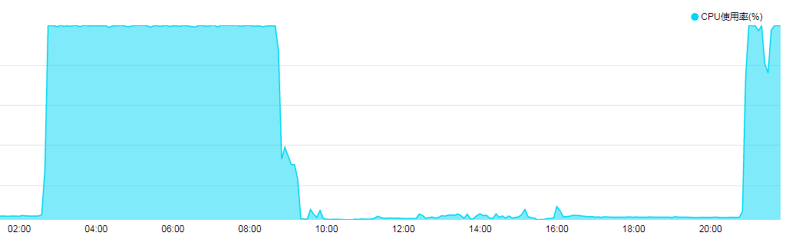
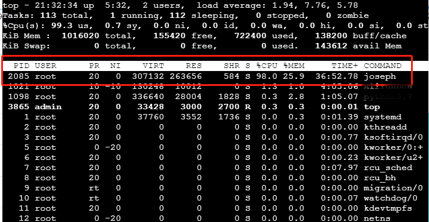
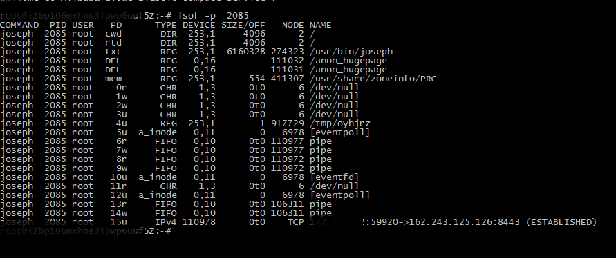

## 事由

网友说某云机器负载异常，CPU占用高，如下图所示，从提供图片，木马选择时段活动。




## 查处过程

### 查看下系统情况

- 查系统时间：date

...略

- 查操作系统：uname -a

...略

- 性能分析工具top

详见下图，可以看出joseph进程占用系统资源。


观察一会儿也还会出现进程tdgfdz。
```
 1707 root      20   0  711776  31876     60 S  1.0  3.1   6:43.95 tdgfdz
```


### 进一步分析

- 查看进程joseph开打的文件,如下图所示。




- 查看进程tdgfdz开打的文件
```
root@xxxx:~/bak# lsof -c tdgfdz
COMMAND  PID USER   FD      TYPE DEVICE SIZE/OFF    NODE NAME
tdgfdz  1707 root  cwd       DIR  253,1     4096  393218 /root
tdgfdz  1707 root  rtd       DIR  253,1     4096       2 /
tdgfdz  1707 root  txt       REG  253,1  3495692  274281 /usr/bin/tdgfdz
tdgfdz  1707 root  mem-W     REG  253,1    73728 1465800 /var/lib/.qsgm/.local
tdgfdz  1707 root    0r      CHR    1,3      0t0       6 /dev/null
tdgfdz  1707 root    1r      CHR    1,3      0t0       6 /dev/null
tdgfdz  1707 root    2r      CHR    1,3      0t0       6 /dev/null
tdgfdz  1707 root    3u      CHR    1,3      0t0       6 /dev/null
tdgfdz  1707 root    4uW     REG  253,1        1  917729 /tmp/oyhjrz
tdgfdz  1707 root    5uW     REG  253,1    73728 1465800 /var/lib/.qsgm/.local
tdgfdz  1707 root    6u  a_inode   0,11        0    6978 [eventpoll]
tdgfdz  1707 root    7r     FIFO   0,10      0t0  106298 pipe
tdgfdz  1707 root    8w     FIFO   0,10      0t0  106298 pipe
tdgfdz  1707 root    9u     IPv4 106309      0t0     TCP *:39050 (LISTEN)
tdgfdz  1707 root   10u     IPv4 928445      0t0     TCP x.x.x.2:38436->server.targetcampus.com:39813 (ESTABLISHED)
tdgfdz  1707 root   11r  a_inode   0,11        0    6978 inotify
tdgfdz  1707 root   12u  a_inode   0,11        0    6978 [eventpoll]
tdgfdz  1707 root   13r     FIFO   0,10      0t0  106311 pipe
tdgfdz  1707 root   14w     FIFO   0,10      0t0  106311 pipe
tdgfdz  1707 root   15u     IPv4 930114      0t0     TCP x.x.x.2:59376->x.x.72.4:36028 (ESTABLISHED)
tdgfdz  1707 root   16uW     REG  253,1        1  917729 /tmp/oyhjrz
tdgfdz  1707 root   17u     IPv4 892136      0t0     TCP x.x.x.2:44866->x.x.40.86:38003 (ESTABLISHED)
tdgfdz  1707 root   18u     IPv4 654190      0t0     TCP x.x.x.2:60570->x.x.11.243:46763 (ESTABLISHED)
tdgfdz  1707 root   20u     IPv4 897980      0t0     TCP x.x.x.2:49836->x.x.4.43:34631 (ESTABLISHED)
tdgfdz  1707 root   21u     IPv4 929868      0t0     TCP x.x.x.2:57342->x.x.220.230:43581 (ESTABLISHED)

```

- 查看进程tdgfdz建立网络
```
root@xxx:/var/log# netstat -anp |grep tdgfdz
tcp        0      0 0.0.0.0:39050           0.0.0.0:*               LISTEN      1707/tdgfdz
tcp        0      0 172.17.9.2:45754        x.x.251.44:38906     ESTABLISHED 1707/tdgfdz
tcp        0      0 172.17.9.2:38436        x.x.99.133:39813    ESTABLISHED 1707/tdgfdz
tcp        0      0 172.17.9.2:49836        x.x.4.43:34631       ESTABLISHED 1707/tdgfdz
tcp        0      0 172.17.9.2:43176        x.x.51.76:49041     ESTABLISHED 1707/tdgfdz
tcp        0      0 172.17.9.2:44866        x.x.40.86:38003     ESTABLISHED 1707/tdgfdz
tcp        0      0 172.17.9.2:34918        x.x.176.5:57782     ESTABLISHED 1707/tdgfdz
```


- 查看 joseph和tdgfdz两个进程打开文件

通过分析，发现/var/lib/.qsgm/.local文件其还有隐藏一个文件/usr/bin/osama。

基本清楚主要木马文件为：/usr/bin/osama,usr/bin/joseph,usr/bin/tdgfdz,/var/lib/.qsgm/.local,/tmp/oyhjrz等

### 木马可能自启动

- crontab位置，已经排查和清除
- 未发现可疑的脚本
查看root用户下.bash_profile 和.bashrc， .bash_logout是否有可疑的启动脚本信息，也未发现。
- 其他也未发现


## 清除过程

主要思路是删除相关文件，杀死进程，用一个文件/root/bak/tt覆盖进程文件，并把些文件权限改为无法写入。操作代码如下，操作后正常。

```
rm -rf /usr/bin/tdgfdz /usr/bin/osama /var/lib/.qsgm/.local  /tmp/joseph
killall tdgfdz
killall joseph
rm -rf /usr/bin/tdgfdz /usr/bin/osama /var/lib/.qsgm/.local  /tmp/joseph

cp /root/bak/tt /usr/bin/tdgfdz
chmod 000  /usr/bin/tdgfdz
cp /root/bak/tt /tmp/joseph
chmod 000  /tmp/joseph

cp /root/bak/tt /usr/bin/joseph
chmod 000  /usr/bin/joseph


```


## 后记

由于网友的主机打开很多服务，还未进一步查通过那个服务插入代码。

